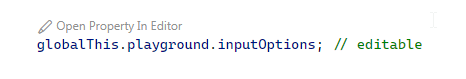

# JS Debug Value Editor

This extension allows to edit and view values of a debugee with a full text editor.

Currently only supports javascript debug adaptors.

## Usage

* Put a property access expression like this into the source code:
```ts
globalThis.playground.inputOptions; // editable
```

* By doing that, a code lens appears:



* Start a JS debug session
* Click on the code lens to view and edit the runtime value of the property. This can be done while the debug session is paused or running. When the debug session is running, the expression must be evaluatable in the global context.
* If the property returns an object that contains a `$fileExtension` property, the opened document will consider that file extension:
```
class MyPlayground {
    inputOptions = {
        $fileExtension: 'txt',
        value: {
            foo: 'bar'
        }
    };
}
```


## Contributing

This project welcomes contributions and suggestions.  Most contributions require you to agree to a
Contributor License Agreement (CLA) declaring that you have the right to, and actually do, grant us
the rights to use your contribution. For details, visit https://cla.opensource.microsoft.com.

When you submit a pull request, a CLA bot will automatically determine whether you need to provide
a CLA and decorate the PR appropriately (e.g., status check, comment). Simply follow the instructions
provided by the bot. You will only need to do this once across all repos using our CLA.

This project has adopted the [Microsoft Open Source Code of Conduct](https://opensource.microsoft.com/codeofconduct/).
For more information see the [Code of Conduct FAQ](https://opensource.microsoft.com/codeofconduct/faq/) or
contact [opencode@microsoft.com](mailto:opencode@microsoft.com) with any additional questions or comments.

## Trademarks

This project may contain trademarks or logos for projects, products, or services. Authorized use of Microsoft 
trademarks or logos is subject to and must follow 
[Microsoft's Trademark & Brand Guidelines](https://www.microsoft.com/en-us/legal/intellectualproperty/trademarks/usage/general).
Use of Microsoft trademarks or logos in modified versions of this project must not cause confusion or imply Microsoft sponsorship.
Any use of third-party trademarks or logos are subject to those third-party's policies.
